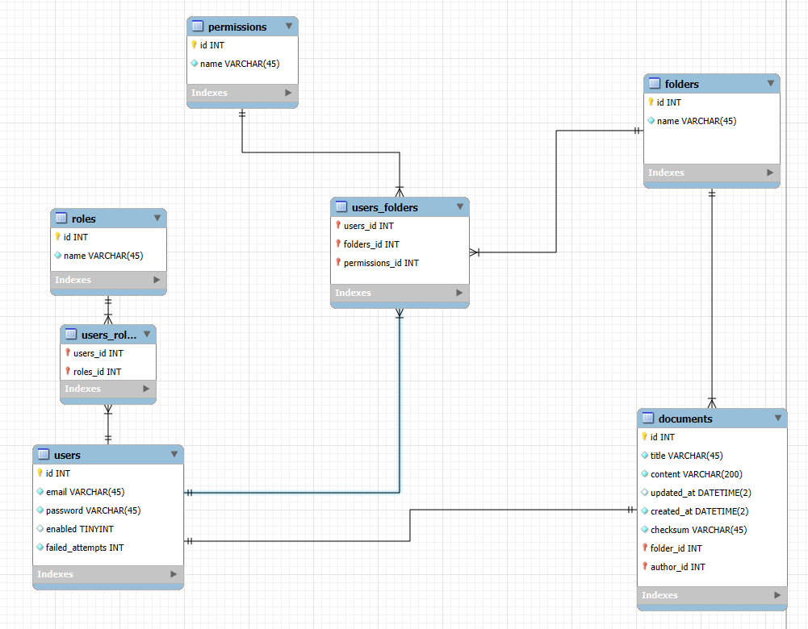

# Documents API
Documents API is a RESTful API built with [NestJS](https://nestjs.com/) for managing documents and folders. It includes features such as:
- User and role management.
- Folder and document management.
- Access control for resources.

## Database
PostgreSQL

## Project setup

```bash
$ npm install
```

## Compile and run the project

```bash
# development
$ npm run start

# watch mode
$ npm run start:dev

# production mode
$ npm run start:prod
```

## Run tests

```bash
# unit tests
$ npm run test

# e2e tests
$ npm run test:e2e

# test coverage
$ npm run test:cov
```
## License

Nest is [MIT licensed](https://github.com/nestjs/nest/blob/master/LICENSE).